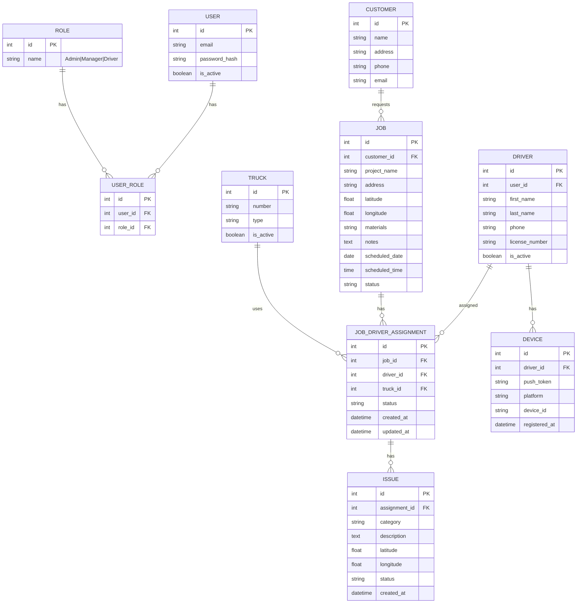

# System Design Document: Eaton Partner Mobile App

> **Document Version:** 1.0 (Draft)
> **Last Updated:** [DATE]
> **Author(s):** [Team Lead Name]
> **Reviewers:** [Mobile Dev, Backend Dev, QA Dev]
> **Status:** Draft | In Review | Approved

---

<!--
==============================================================================
HOW TO USE THIS TEMPLATE
==============================================================================
This template follows industry-standard practices used at companies like
Google, Uber, and Stripe. Each section includes:

1. [GUIDANCE] - Explains WHY this section matters and HOW to fill it out
2. [EXAMPLE] - Shows what good content looks like for this project
3. [YOUR CONTENT HERE] - Where you write your actual content

Delete the [GUIDANCE] and [EXAMPLE] blocks once you've written your content.
Keep the structure clean for reviewers.
==============================================================================
-->

## Table of Contents
1. [Executive Summary](#1-executive-summary)
2. [Goals and Non-Goals](#2-goals-and-non-goals)
3. [User Roles and Personas](#3-user-roles-and-personas)
4. [Functional Requirements](#4-functional-requirements)
5. [Non-Functional Requirements](#5-non-functional-requirements)
6. [System Architecture](#6-system-architecture)
7. [API Design](#7-api-design)
8. [Data Model](#8-data-model)
9. [Security Design](#9-security-design)
10. [Offline and Sync Strategy](#10-offline-and-sync-strategy)
11. [Testing Strategy](#11-testing-strategy)
12. [Risks and Mitigations](#12-risks-and-mitigations)
13. [Alternatives Considered](#13-alternatives-considered)
14. [Open Questions](#14-open-questions)

**Appendices:**
- [Appendix A: Existing Codebase Reference](#appendix-a-existing-codebase-reference)
- [Appendix B: Glossary](#appendix-b-glossary)
- [Appendix C: References](#appendix-c-references)

---

## 1. Executive Summary

<!--
[GUIDANCE]
This is a 1-paragraph overview that anyone can read and understand the project.
Answer: What problem are we solving? For whom? What's our approach?
Keep it to 3-5 sentences. Executives and stakeholders read this first.
-->

<!--
[EXAMPLE]
M Eaton Trucking LLC operates a fleet of trucks for material delivery. Dispatchers
currently assign jobs to drivers via the web platform, but drivers have no mobile
access to view assignments, navigate to locations, or report issues in real-time.
This document describes the design of a React Native mobile app that enables drivers
to receive job assignments, view schedules, get push notifications, and communicate
issues back to dispatch. The app will integrate with the existing Django REST backend
and PostgreSQL database hosted on Supabase.
-->

[YOUR EXECUTIVE SUMMARY HERE]

---

## 2. Goals and Non-Goals

<!--
[GUIDANCE]
This section prevents scope creep and aligns the team. Be explicit about what
you WON'T do - it's as important as what you will do.

Goals should be:
- Specific and measurable when possible
- Tied to user or business outcomes

Non-Goals should:
- Explicitly call out things people might assume are in scope
- Prevent "while we're at it" feature additions
-->

### 2.1 Goals

| ID | Goal | Success Metric |
|----|------|----------------|
| G1 | Drivers can view their assigned jobs on mobile | 100% of assignments visible within 5 seconds of app open |
| G2 | Drivers receive push notifications for new/changed assignments | Notifications delivered within 30 seconds of dispatch action |
| G3 | Drivers can report issues from the field | Issue reports captured with timestamp, location, and photos |
| G4 | App works with intermittent connectivity | Core job data available offline after initial sync |
| G5 | [ADD MORE GOALS] | [METRIC] |

### 2.2 Non-Goals

<!--
[EXAMPLE]
These are explicitly OUT OF SCOPE for this version:
-->

| ID | Non-Goal | Rationale |
|----|----------|-----------|
| NG1 | Customer-facing features | This app is for drivers only; customers use the web portal |
| NG2 | Real-time GPS tracking visible to dispatch | Privacy/scope concerns; may be Phase 2 |
| NG3 | In-app messaging/chat | Drivers can use phone calls; adds complexity |
| NG4 | Route optimization | Drivers use Google Maps/Waze externally |
| NG5 | [ADD MORE NON-GOALS] | [RATIONALE] |

---

## 3. User Roles and Personas

<!--
[GUIDANCE]
Define WHO uses the system and WHAT they need. This drives feature decisions.
For each role, describe:
- Who they are (demographics, tech comfort)
- What they need to accomplish
- Pain points with current process
- Key scenarios they'll use the app for
-->

### 3.1 Primary User: Driver

| Attribute | Description |
|-----------|-------------|
| **Who** | CDL-licensed truck drivers, ages 25-55, varying tech comfort |
| **Device** | Personal Android or iOS smartphone |
| **Context** | Using app while on-the-go, often one-handed, variable connectivity |
| **Goals** | See today's jobs, get directions, report problems, know when schedule changes |
| **Pain Points** | Currently relies on phone calls from dispatch; no written record; misses updates |

**Key User Stories:**
1. As a driver, I want to see my assigned jobs for today so I know my schedule
2. As a driver, I want to receive a notification when I'm assigned a new job
3. As a driver, I want to mark a job as complete so dispatch knows I'm done
4. As a driver, I want to report an issue with photos so dispatch can help
5. [ADD MORE USER STORIES]

### 3.2 Secondary User: Dispatcher/Manager (Indirect)

| Attribute | Description |
|-----------|-------------|
| **Who** | Office staff using the web platform |
| **Interaction** | They don't use the mobile app directly, but they see driver updates |
| **Needs** | Know driver saw the assignment, track job status, receive issue reports |

---

## 4. Functional Requirements

<!--
[GUIDANCE]
List every feature the app must have. Be specific enough that a developer
could implement it and a QA engineer could test it.

Format: FR-[Category]-[Number]
Categories: AUTH, JOB, NOTIF, ISSUE, SYNC, etc.
-->

### 4.1 Authentication (AUTH)

| ID | Requirement | Priority | Notes |
|----|-------------|----------|-------|
| FR-AUTH-01 | Driver can log in with email and password | P0 | Use existing JWT endpoint |
| FR-AUTH-02 | App stores auth token securely | P0 | Use SecureStore (iOS) / EncryptedSharedPreferences (Android) |
| FR-AUTH-03 | App automatically refreshes expired tokens | P0 | Use refresh token flow |
| FR-AUTH-04 | Driver can reset password via email OTP | P1 | Existing SMTP2GO flow |
| FR-AUTH-05 | App shows appropriate error for invalid credentials | P0 | |
| FR-AUTH-06 | Driver can log out | P0 | Clear tokens, return to login |

### 4.2 Job Management (JOB)

| ID | Requirement | Priority | Notes |
|----|-------------|----------|-------|
| FR-JOB-01 | Driver can view list of assigned jobs | P0 | |
| FR-JOB-02 | Jobs are grouped by date (Today, Upcoming) | P1 | |
| FR-JOB-03 | Driver can view job details (customer, address, materials, notes) | P0 | |
| FR-JOB-04 | Driver can update job status (en route, arrived, complete) | P0 | |
| FR-JOB-05 | Job list shows visual indicators for status | P1 | Color coding |
| FR-JOB-06 | Driver can tap address to open in Maps app | P1 | Deep link to Google Maps/Apple Maps |
| FR-JOB-07 | [ADD MORE] | | |

### 4.3 Notifications (NOTIF)

| ID | Requirement | Priority | Notes |
|----|-------------|----------|-------|
| FR-NOTIF-01 | Driver receives push notification for new job assignment | P0 | |
| FR-NOTIF-02 | Driver receives push notification for job changes | P0 | Time, location changes |
| FR-NOTIF-03 | Driver receives push notification for job cancellation | P0 | |
| FR-NOTIF-04 | Tapping notification opens relevant job detail | P1 | Deep linking |
| FR-NOTIF-05 | App shows in-app notification history | P2 | |

### 4.4 Issue Reporting (ISSUE)

| ID | Requirement | Priority | Notes |
|----|-------------|----------|-------|
| FR-ISSUE-01 | Driver can report an issue for a job | P0 | |
| FR-ISSUE-02 | Issue report includes category (delay, vehicle, customer, other) | P1 | |
| FR-ISSUE-03 | Driver can attach photos to issue report | P1 | |
| FR-ISSUE-04 | Issue report captures timestamp and GPS location | P1 | |
| FR-ISSUE-05 | Driver receives confirmation when issue is submitted | P0 | |

### 4.5 Offline Support (SYNC)

| ID | Requirement | Priority | Notes |
|----|-------------|----------|-------|
| FR-SYNC-01 | App caches job data for offline viewing | P0 | |
| FR-SYNC-02 | Status updates queue when offline, sync when online | P0 | |
| FR-SYNC-03 | App shows clear indicator when offline | P1 | |
| FR-SYNC-04 | App shows last sync timestamp | P2 | |

---

## 5. Non-Functional Requirements

<!--
[GUIDANCE]
These are the quality attributes - how well the system performs, not what it does.
Be specific with numbers when possible. These become acceptance criteria.
-->

### 5.1 Performance

| Requirement | Target | Measurement |
|-------------|--------|-------------|
| App launch to usable | < 3 seconds | Cold start on mid-range device |
| Job list load time | < 2 seconds | On 4G connection |
| API response time | < 500ms (p95) | Backend measurement |
| Offline data availability | < 1 second | From local cache |

### 5.2 Reliability

| Requirement | Target |
|-------------|--------|
| App crash rate | < 1% of sessions |
| API availability | 99.5% uptime |
| Push notification delivery | > 95% within 30 seconds |

### 5.3 Security

| Requirement | Details |
|-------------|---------|
| Token storage | Use platform secure storage (Keychain/Keystore) |
| Network | All API calls over HTTPS |
| Session timeout | Require re-auth after 7 days of inactivity |
| No sensitive data in logs | Mask tokens, PII in debug logs |

### 5.4 Compatibility

| Platform | Minimum Version |
|----------|-----------------|
| iOS | 14.0+ |
| Android | API 26 (Android 8.0)+ |
| Screen sizes | 4.7" to 6.7" |

### 5.5 Accessibility

| Requirement | Details |
|-------------|---------|
| Font scaling | Support system font size preferences |
| Color contrast | Meet WCAG 2.1 AA standards |
| Screen reader | Core flows usable with VoiceOver/TalkBack |

---

## 6. System Architecture

<!--
[GUIDANCE]
This is the most important diagram. Show all the major components and how they connect.
Use a layered approach: Client -> API -> Database/Services

For interviews and industry, you should be able to:
1. Draw this on a whiteboard
2. Explain what each component does
3. Explain why you made these choices
-->

### 6.1 High-Level Architecture Diagram

```
┌─────────────────────────────────────────────────────────────────────────────┐
│                              EATON SYSTEM ARCHITECTURE                       │
│                        (Existing Platform + New Mobile App)                  │
└─────────────────────────────────────────────────────────────────────────────┘

    ┌─────────────────────────────────────────────────────────────────────┐
    │                           CLIENT LAYER                               │
    ├─────────────────────────────────────────────────────────────────────┤
    │                                                                      │
    │  ┌─────────────────┐    ┌─────────────────┐    ┌─────────────────┐  │
    │  │   iOS Device    │    │ Android Device  │    │   Web Browser   │  │
    │  │  ┌───────────┐  │    │  ┌───────────┐  │    │  ┌───────────┐  │  │
    │  │  │  Partner  │  │    │  │  Partner  │  │    │  │  Angular  │  │  │
    │  │  │    App    │  │    │  │    App    │  │    │  │    Web    │  │  │
    │  │  │  (React   │  │    │  │  (React   │  │    │  │    App    │  │  │
    │  │  │  Native)  │  │    │  │  Native)  │  │    │  │  (v19)    │  │  │
    │  │  └───────────┘  │    │  └───────────┘  │    │  └───────────┘  │  │
    │  │                 │    │                 │    │                 │  │
    │  │   [NEW - US]    │    │   [NEW - US]    │    │   [EXISTING]    │  │
    │  │   For Drivers   │    │   For Drivers   │    │ For Dispatchers │  │
    │  └────────┬────────┘    └────────┬────────┘    └────────┬────────┘  │
    │           │                      │                      │           │
    └───────────┼──────────────────────┼──────────────────────┼───────────┘
                │                      │                      │
                │      HTTPS/REST      │                      │
                └──────────┬───────────┘                      │
                           │                                  │
                           ▼                                  ▼
    ┌─────────────────────────────────────────────────────────────────────┐
    │                           API LAYER                                  │
    │                  Django 5.1.6 + REST Framework                       │
    ├─────────────────────────────────────────────────────────────────────┤
    │                                                                      │
    │  [EXISTING ENDPOINTS]              [NEW ENDPOINTS - TO BUILD]        │
    │  ┌─────────────────────┐           ┌─────────────────────┐          │
    │  │ /api/auth/          │           │ /api/mobile/        │          │
    │  │ /api/jobs/          │           │   my-assignments/   │          │
    │  │ /api/drivers/       │           │   issues/           │          │
    │  │ /api/trucks/        │           │   devices/          │          │
    │  │ /api/customers/     │           │                     │          │
    │  │ /api/job-driver-    │           │ Push notification   │          │
    │  │     assignments/    │           │ triggers            │          │
    │  │ /api/invoices/      │           │                     │          │
    │  │ /api/pay-reports/   │           └─────────────────────┘          │
    │  └─────────────────────┘                                            │
    │                                                                      │
    └───────────────────────────────┬─────────────────────────────────────┘
                                    │
                ┌───────────────────┼───────────────────┐
                │                   │                   │
                ▼                   ▼                   ▼
    ┌───────────────────┐ ┌───────────────────┐ ┌───────────────────┐
    │    PostgreSQL     │ │   Push Service    │ │    Email SMTP     │
    │    (Supabase)     │ │   (FCM / APNs)    │ │    (SMTP2GO)      │
    │                   │ │                   │ │                   │
    │  EXISTING TABLES: │ │  [TO IMPLEMENT]   │ │  [EXISTING]       │
    │  • User/Role      │ │  • New job alert  │ │  • Password reset │
    │  • Driver         │ │  • Job changed    │ │  • OTP delivery   │
    │  • Truck          │ │  • Job cancelled  │ │                   │
    │  • Customer       │ │                   │ │                   │
    │  • Job            │ │                   │ │                   │
    │  • JobDriver-     │ │                   │ │                   │
    │    Assignment     │ │                   │ │                   │
    │  • Invoice        │ │                   │ │                   │
    │  • PayReport      │ │                   │ │                   │
    │                   │ │                   │ │                   │
    │  NEW TABLES:      │ │                   │ │                   │
    │  • Issue          │ │                   │ │                   │
    │  • Device         │ │                   │ │                   │
    └───────────────────┘ └───────────────────┘ └───────────────────┘
```

**Legend:**
- `[EXISTING]` = Built by previous team, ready to use
- `[NEW - US]` = Our team builds this
- `[TO IMPLEMENT]` = Backend Dev needs to add this

### 6.2 Mobile App Component Diagram

```
┌─────────────────────────────────────────────────────────────────────────────┐
│                           REACT NATIVE APP STRUCTURE                         │
└─────────────────────────────────────────────────────────────────────────────┘

┌─────────────────────────────────────────────────────────────────────────────┐
│                              PRESENTATION LAYER                              │
│  ┌─────────────┐ ┌─────────────┐ ┌─────────────┐ ┌─────────────┐           │
│  │   Login     │ │  Job List   │ │ Job Detail  │ │Report Issue │           │
│  │   Screen    │ │   Screen    │ │   Screen    │ │   Screen    │           │
│  └─────────────┘ └─────────────┘ └─────────────┘ └─────────────┘           │
└─────────────────────────────────────────────────────────────────────────────┘
                                    │
                                    ▼
┌─────────────────────────────────────────────────────────────────────────────┐
│                              STATE MANAGEMENT                                │
│  ┌─────────────────────────────────────────────────────────────────────┐   │
│  │                    React Context / Zustand / Redux                   │   │
│  │   • Auth State (token, user)                                        │   │
│  │   • Jobs State (list, selected, filters)                            │   │
│  │   • Sync State (online/offline, pending actions)                    │   │
│  │   • Notification State (unread count, history)                      │   │
│  └─────────────────────────────────────────────────────────────────────┘   │
└─────────────────────────────────────────────────────────────────────────────┘
                                    │
                                    ▼
┌─────────────────────────────────────────────────────────────────────────────┐
│                               SERVICE LAYER                                  │
│  ┌──────────────┐ ┌──────────────┐ ┌──────────────┐ ┌──────────────┐       │
│  │ Auth Service │ │ Job Service  │ │ Sync Service │ │ Push Service │       │
│  └──────────────┘ └──────────────┘ └──────────────┘ └──────────────┘       │
└─────────────────────────────────────────────────────────────────────────────┘
                                    │
                                    ▼
┌─────────────────────────────────────────────────────────────────────────────┐
│                                DATA LAYER                                    │
│  ┌─────────────────────────────┐    ┌─────────────────────────────┐        │
│  │       API Client            │    │      Local Storage          │        │
│  │   (Axios / Fetch)           │    │  (AsyncStorage / SQLite)    │        │
│  └─────────────────────────────┘    └─────────────────────────────┘        │
└─────────────────────────────────────────────────────────────────────────────┘
```

### 6.3 Technology Stack

#### Mobile App (New - Our Team)

| Layer | Technology | Rationale |
|-------|------------|-----------|
| Mobile Framework | React Native (Expo) | Cross-platform, large ecosystem, team familiarity |
| Navigation | React Navigation | Industry standard for RN |
| State Management | [Zustand / Redux Toolkit / Context] | [DECISION NEEDED] |
| Local Storage | [AsyncStorage / SQLite / WatermelonDB] | [DECISION NEEDED] |
| API Client | Axios | Request/response interceptors for auth |
| Push Notifications | Expo Notifications + FCM/APNs | Unified API, handles both platforms |
| Secure Storage | expo-secure-store | Platform-native secure storage |

#### Existing Backend (Previous Team - Already Built)

| Layer | Technology | Version | Notes |
|-------|------------|---------|-------|
| Backend Framework | Django | 5.1.6 | Production-ready |
| REST API | Django REST Framework | - | Full CRUD for all entities |
| Authentication | djangorestframework-simplejwt | - | JWT with refresh tokens |
| Password Reset | SMTP2GO | - | OTP-based email reset |
| Database | PostgreSQL | - | Hosted on Supabase |
| Web Frontend | Angular | 19 | Used by dispatchers/managers |
| Maps | Leaflet.js | - | Location visualization on web |
| PDF Reports | jsPDF + html2canvas | - | Invoice/pay report generation |

#### Development Environment (From Previous Team)

| Service | Port | Purpose |
|---------|------|---------|
| Angular Frontend | 4200 | Web platform for dispatchers |
| Django Backend | 8000 | REST API |
| PostgreSQL | 5432 | Database |
| MailHog | 8025 | Email testing (dev only) |

**Docker Compose** is available at `prev-team/F25 Eaton Trucking Project/Eaton-LLC-Webapp-/` for full-stack local development.

---

## 7. API Design

<!--
[GUIDANCE]
Document the API contract between mobile and backend.
Include: endpoints, methods, request/response schemas, auth requirements.

For existing endpoints, note if they need modifications for mobile.
For new endpoints, provide full specification.
-->

### 7.1 Existing Endpoints (Built by Previous Team)

> **Source:** `prev-team/F25 Eaton Trucking Project/Eaton-LLC-Webapp-/backend/myapp/urls.py`

#### Authentication Endpoints

| Endpoint | Method | Purpose | Mobile Ready? |
|----------|--------|---------|---------------|
| `/api/auth/token/` | POST | Obtain JWT access + refresh tokens | Yes - use as-is |
| `/api/auth/token/refresh/` | POST | Refresh access token | Yes - use as-is |
| `/api/auth/register/` | POST | User registration | N/A - drivers added by admin |
| `/api/auth/password-reset/` | POST | Request OTP for password reset | Yes - use as-is |
| `/api/auth/password-reset/confirm/` | POST | Confirm password reset with OTP | Yes - use as-is |

#### Core Business Endpoints

| Endpoint | Method | Purpose | Mobile Changes Needed? |
|----------|--------|---------|------------------------|
| `/api/jobs/` | GET, POST | Job CRUD operations | Add `?driver_id=` filter |
| `/api/jobs/{id}/` | GET, PUT, DELETE | Single job operations | None - use as-is |
| `/api/customers/` | GET, POST | Customer management | Read-only for mobile |
| `/api/customers/{id}/` | GET, PUT, DELETE | Single customer | Read-only for mobile |
| `/api/drivers/` | GET, POST | Driver management | Add "me" endpoint for profile |
| `/api/drivers/{id}/` | GET, PUT, DELETE | Single driver | None - use as-is |
| `/api/trucks/` | GET, POST | Truck fleet management | Read-only for mobile |
| `/api/trucks/{id}/` | GET, PUT, DELETE | Single truck | None - use as-is |
| `/api/job-driver-assignments/` | GET, POST | Dispatch assignments | Add `?driver_id=` and `?date=` filters |
| `/api/job-driver-assignments/{id}/` | GET, PUT, DELETE | Single assignment | Add PATCH for status updates |

#### Financial Endpoints (Not Used by Mobile)

| Endpoint | Method | Purpose | Mobile Use |
|----------|--------|---------|------------|
| `/api/invoices/` | GET, POST | Invoice generation | Not needed |
| `/api/invoices/{id}/` | GET, PUT, DELETE | Single invoice | Not needed |
| `/api/pay-reports/` | GET, POST | Driver pay reports | Not needed |
| `/api/pay-reports/{id}/` | GET, PUT, DELETE | Single pay report | Not needed |

### 7.2 New Endpoints Needed

#### 7.2.1 Get Driver's Assignments

```
GET /api/mobile/my-assignments/
Authorization: Bearer <token>

Query Parameters:
  - date_from: ISO date (optional, default: today)
  - date_to: ISO date (optional, default: today + 7 days)
  - status: pending|in_progress|completed (optional)

Response 200:
{
  "count": 5,
  "results": [
    {
      "id": 123,
      "job": {
        "id": 456,
        "customer_name": "ABC Construction",
        "address": "123 Main St, City, ST 12345",
        "latitude": 40.7128,
        "longitude": -74.0060,
        "materials": "Gravel - 10 tons",
        "notes": "Gate code: 1234",
        "scheduled_date": "2025-01-27",
        "scheduled_time": "09:00:00"
      },
      "truck": {
        "id": 789,
        "number": "T-101",
        "type": "Dump Truck"
      },
      "status": "pending",
      "created_at": "2025-01-26T14:30:00Z",
      "updated_at": "2025-01-26T14:30:00Z"
    }
  ]
}
```

#### 7.2.2 Update Assignment Status

```
PATCH /api/mobile/my-assignments/{id}/status/
Authorization: Bearer <token>

Request:
{
  "status": "in_progress",  // en_route | arrived | in_progress | completed
  "latitude": 40.7128,       // optional, for location tracking
  "longitude": -74.0060,
  "timestamp": "2025-01-27T09:15:00Z"
}

Response 200:
{
  "id": 123,
  "status": "in_progress",
  "updated_at": "2025-01-27T09:15:00Z"
}
```

#### 7.2.3 Report Issue

```
POST /api/mobile/issues/
Authorization: Bearer <token>
Content-Type: multipart/form-data

Request:
{
  "assignment_id": 123,
  "category": "vehicle|delay|customer|safety|other",
  "description": "Flat tire on truck",
  "latitude": 40.7128,
  "longitude": -74.0060,
  "photos": [<file>, <file>]  // optional, up to 3 photos
}

Response 201:
{
  "id": 789,
  "assignment_id": 123,
  "category": "vehicle",
  "description": "Flat tire on truck",
  "status": "reported",
  "created_at": "2025-01-27T10:30:00Z"
}
```

#### 7.2.4 Register Push Token

```
POST /api/mobile/devices/
Authorization: Bearer <token>

Request:
{
  "token": "<expo-push-token-or-fcm-token>",
  "platform": "ios|android",
  "device_id": "<unique-device-identifier>"
}

Response 201:
{
  "id": 1,
  "registered_at": "2025-01-27T08:00:00Z"
}
```

---

## 8. Data Model

<!--
[GUIDANCE]
Show the key entities and their relationships.
Focus on what's relevant to the mobile app's view of the data.
Use an ER diagram for clarity.
-->

> **Source:** `prev-team/F25 Eaton Trucking Project/Eaton-LLC-Webapp-/backend/myapp/models.py`

### 8.1 Existing Models (Built by Previous Team)

The previous team created comprehensive models organized into these categories:

#### User Management
| Model | Purpose |
|-------|---------|
| `Role` | Defines roles: Admin, Manager, Driver |
| `UserRole` | Links users to roles (RBAC) |

#### Fleet Management
| Model | Purpose |
|-------|---------|
| `Operator` | Company/operator that owns trucks |
| `Truck` | Individual trucks in the fleet |
| `Driver` | Driver profiles with license info |
| `DriverTruckAssignment` | Links drivers to trucks they can operate |

#### Business Operations
| Model | Purpose |
|-------|---------|
| `Customer` | Customer/client information |
| `Job` | Delivery jobs with schedule, location, materials |
| `JobDriverAssignment` | **Key model** - links Driver + Truck + Job for dispatch |

#### Financial (Not Used by Mobile)
| Model | Purpose |
|-------|---------|
| `Invoice` | Customer invoices |
| `InvoiceLine` | Line items on invoices |
| `PayReport` | Driver pay reports |
| `PayReportLine` | Line items on pay reports |

### 8.2 Entity Relationship Diagram (Mobile-Relevant Models)



### 8.3 New Models Needed for Mobile

| Model | Purpose | Fields |
|-------|---------|--------|
| `Issue` | Driver-reported problems | assignment_id, category, description, lat/lng, photos, status |
| `Device` | Push notification tokens | driver_id, push_token, platform, device_id |

These models need to be added to the Django backend by the Backend Dev.

### 8.2 Data Stored Locally (Offline Cache)

| Entity | Cached? | Sync Strategy |
|--------|---------|---------------|
| Driver Profile | Yes | Fetch on login, refresh on app open |
| Job Assignments | Yes | Fetch on app open, refresh every 5 min |
| Job Details | Yes | Cached with assignment |
| Pending Status Updates | Yes | Queue locally, sync when online |
| Pending Issue Reports | Yes | Queue locally, sync when online |
| Push Token | Yes | Store locally, register on login |

---

## 9. Security Design

<!--
[GUIDANCE]
Security is critical for mobile apps. Document:
- How authentication works
- How sensitive data is protected
- What happens in attack scenarios
-->

### 9.1 Authentication Flow


### 9.2 Security Measures

| Concern | Mitigation |
|---------|------------|
| Token theft | Use platform SecureStore (Keychain/Keystore), not AsyncStorage |
| Man-in-the-middle | HTTPS only, certificate pinning (optional, adds complexity) |
| Unauthorized access | JWT validation on every request, role check (Driver only) |
| Session hijacking | Short-lived access tokens (15 min), refresh token rotation |
| Data at rest | Encrypt sensitive local cache (if storing PII) |
| Debug builds | Strip logs in production, no sensitive data in crash reports |

### 9.3 Role-Based Access

| Action | Driver | Manager | Admin |
|--------|--------|---------|-------|
| View own assignments | Yes | Yes | Yes |
| View all assignments | No | Yes | Yes |
| Update own job status | Yes | Yes | Yes |
| Report issues | Yes | Yes | Yes |
| Cancel jobs | No | Yes | Yes |
| Manage drivers | No | No | Yes |

---

## 10. Offline and Sync Strategy

<!--
[GUIDANCE]
Offline support is critical for drivers in areas with poor connectivity.
Document:
- What data is available offline
- How offline changes are queued and synced
- How conflicts are resolved
-->

### 10.1 Offline Capabilities

| Feature | Offline Capability |
|---------|-------------------|
| View job list | Yes (cached data) |
| View job details | Yes (cached data) |
| Update job status | Yes (queued, syncs when online) |
| Report issue | Yes (queued, syncs when online) |
| Receive notifications | No (requires connectivity) |
| Login | No (requires connectivity) |

### 10.2 Sync Flow


### 10.3 Conflict Resolution

| Scenario | Resolution Strategy |
|----------|---------------------|
| Driver updates status, but dispatcher already changed job | Show alert: "This job was updated. Please review the changes." |
| Driver reports issue for cancelled job | Accept the issue anyway, link to original job |
| Same status update sent twice | Idempotent: backend ignores duplicate |

---

## 11. Testing Strategy

<!--
[GUIDANCE]
Document how the app will be tested at each level.
This becomes input for the QA Dev's test plan.
-->

### 11.1 Test Levels

| Level | Scope | Tools | Owner |
|-------|-------|-------|-------|
| Unit Tests | Individual components, functions | Jest, React Native Testing Library | Mobile Dev + QA Dev |
| Integration Tests | API contract, data flow | Jest, MSW (Mock Service Worker) | QA Dev |
| E2E Tests | Full user flows on real devices | Detox or Maestro | QA Dev |
| Manual Testing | Exploratory, edge cases | Test devices | QA Dev + Team |
| Usability Testing | Real driver feedback | Prototype or beta app | Team Lead + QA Dev |

### 11.2 Critical Test Scenarios

| ID | Scenario | Priority |
|----|----------|----------|
| T1 | Login with valid credentials | P0 |
| T2 | Login with invalid credentials shows error | P0 |
| T3 | Token refresh works transparently | P0 |
| T4 | Job list loads and displays correctly | P0 |
| T5 | Job status update succeeds | P0 |
| T6 | Offline status update syncs when online | P0 |
| T7 | Push notification received and opens correct job | P0 |
| T8 | Issue report with photos uploads successfully | P1 |
| T9 | App handles no network gracefully | P1 |
| T10 | App works on minimum supported OS versions | P1 |

### 11.3 Test Environments

| Environment | Purpose | Backend |
|-------------|---------|---------|
| Local | Development testing | Local Docker (docker-compose) |
| Staging | Integration testing | Staging server |
| Production | Final validation | Production server (read-only tests) |

### 11.4 Existing Test Infrastructure (From Previous Team)

The previous team set up testing infrastructure we can leverage:

| Area | Tool | Location | Notes |
|------|------|----------|-------|
| Backend Tests | pytest + Django plugin | `backend/myapp/tests/` | Has fixtures in `conftest.py` |
| Test Coverage | pytest-cov | Run with `--cov=myapp` | Invoice tests have good coverage as reference |
| Frontend Tests | Karma + Jasmine | `frontend/` | Configured but needs expansion |
| Email Testing | MailHog | http://localhost:8025 | Catches OTP emails in dev |

**Commands:**
```bash
# Backend tests
cd "prev-team/F25 Eaton Trucking Project/Eaton-LLC-Webapp-/backend"
pytest                           # Run all tests
pytest --cov=myapp --cov-report=html  # With coverage

# Frontend tests
cd "prev-team/F25 Eaton Trucking Project/Eaton-LLC-Webapp-/frontend"
npm test
```

---

## 12. Risks and Mitigations

<!--
[GUIDANCE]
Identify what could go wrong and how you'll handle it.
This shows mature engineering thinking.
-->

| Risk | Likelihood | Impact | Mitigation |
|------|------------|--------|------------|
| Existing API doesn't support driver-specific queries | Medium | High | Audit API in Week 1, plan new endpoints early |
| Push notification setup is complex (certs, tokens) | Medium | Medium | Start FCM/APNs setup early, use Expo for simplicity |
| iOS build requires Apple Developer account we don't have | Low | High | Verify account access in Week 1 |
| Offline sync causes data conflicts | Medium | Medium | Design simple conflict resolution, test thoroughly |
| Performance issues on older devices | Medium | Medium | Test on low-end devices early, optimize images/lists |
| Scope creep delays delivery | Medium | High | Strict adherence to non-goals, weekly scope review |

---

## 13. Alternatives Considered

<!--
[GUIDANCE]
Document major decisions and why you chose your approach.
This is crucial - it shows you evaluated options, not just picked the first thing.
Reviewers and future maintainers will thank you.
-->

### 13.1 Mobile Framework

| Option | Pros | Cons | Decision |
|--------|------|------|----------|
| **React Native (Expo)** | Cross-platform, large ecosystem, OTA updates, easier build process | Larger app size, some native limits | **Selected** - Best balance of speed and capability |
| React Native (Bare) | Full native access, smaller app size | More complex build setup, no OTA updates | Rejected - Adds complexity without clear benefit |
| Flutter | Fast performance, beautiful UI | Different language (Dart), smaller ecosystem | Rejected - Team has React experience |
| Native (Swift + Kotlin) | Best performance, full platform access | 2x development effort, 2 codebases | Rejected - Timeline doesn't allow |

### 13.2 State Management

| Option | Pros | Cons | Decision |
|--------|------|------|----------|
| **Zustand** | Simple, small, hooks-based | Less ecosystem than Redux | [EVALUATE] |
| Redux Toolkit | Mature, great DevTools, large ecosystem | More boilerplate | [EVALUATE] |
| React Context | Built-in, no dependencies | Re-render issues at scale | Rejected - Performance concerns |

### 13.3 Offline Storage

| Option | Pros | Cons | Decision |
|--------|------|------|----------|
| **AsyncStorage** | Simple, built into Expo | Not great for complex queries | [EVALUATE] |
| SQLite | Relational queries, good performance | More setup, migrations | [EVALUATE] |
| WatermelonDB | Designed for sync, lazy loading | Learning curve, complex | Rejected - Overkill for our data size |

---

## 14. Open Questions

<!--
[GUIDANCE]
Be honest about what you don't know yet.
These become research/decision items for the team.
-->

| # | Question | Owner | Due Date | Resolution |
|---|----------|-------|----------|------------|
| 1 | Do we have access to an Apple Developer account? | Team Lead | Week 1 | |
| 2 | What's the expected number of concurrent drivers? | Team Lead | Week 1 | |
| 3 | Are there branding/design guidelines from the client? | Team Lead | Week 1 | |
| 4 | Which state management library should we use? | Mobile Dev | Week 2 | |
| 5 | Do drivers need to see historical (completed) jobs? | Team Lead | Week 1 | |
| 6 | What issue categories does dispatch want? | Team Lead | Week 1 | |
| 7 | Should we support tablet layouts? | Mobile Dev | Week 2 | |

---

## Appendix A: Existing Codebase Reference

The previous team's work is located at:

```
prev-team/F25 Eaton Trucking Project/Eaton-LLC-Webapp-/
├── backend/                    # Django REST API
│   ├── backend_project/        # Django project config (settings, URLs)
│   ├── myapp/                  # Main app with models, views, serializers
│   │   ├── models.py           # All database models
│   │   ├── views.py            # ViewSets for REST endpoints
│   │   ├── serializers.py      # DRF serializers
│   │   ├── urls.py             # API routing
│   │   └── tests/              # pytest tests
│   ├── requirements.txt        # Python dependencies
│   └── manage.py
├── frontend/                   # Angular 19 web app
│   ├── src/app/
│   │   ├── pages/              # Feature modules (jobs, dispatch, fleet, etc.)
│   │   ├── services/           # API service layer
│   │   ├── guards/             # Auth guards
│   │   └── models/             # TypeScript interfaces
│   └── package.json
└── docker-compose.yml          # Full stack local dev
```

### Key Files to Review

| File | Purpose |
|------|---------|
| `backend/myapp/models.py` | All database models (Job, Driver, Assignment, etc.) |
| `backend/myapp/views.py` | API endpoints implementation |
| `backend/myapp/serializers.py` | Request/response data shapes |
| `frontend/src/app/services/` | How Angular calls the API (patterns to follow) |
| `docker-compose.yml` | Local development setup |

### Quick Start Commands

```bash
# Start the full stack locally
cd "prev-team/F25 Eaton Trucking Project/Eaton-LLC-Webapp-"
docker-compose up --build

# Access points:
# - Web App: http://localhost:4200
# - API: http://localhost:8000/api/
# - MailHog: http://localhost:8025
```

---

## Appendix B: Glossary

| Term | Definition |
|------|------------|
| Assignment | A link between a driver, a truck, and a job for a specific date (`JobDriverAssignment` model) |
| Job | A delivery task with customer, location, and materials info |
| Dispatch | The office team that assigns jobs to drivers (use web platform) |
| OTA Update | Over-the-air update that pushes code changes without app store review (Expo feature) |
| JWT | JSON Web Token - used for authentication (via `djangorestframework-simplejwt`) |
| FCM | Firebase Cloud Messaging - Google's push notification service |
| APNs | Apple Push Notification service |
| DRF | Django REST Framework - the API layer of the existing backend |
| ViewSet | DRF class that provides CRUD operations for a model |

---

## Appendix C: References

- [React Native Documentation](https://reactnative.dev/)
- [Expo Documentation](https://docs.expo.dev/)
- [Django REST Framework](https://www.django-rest-framework.org/)
- [Firebase Cloud Messaging](https://firebase.google.com/docs/cloud-messaging)
- [Apple Push Notifications](https://developer.apple.com/documentation/usernotifications)
- [OWASP Mobile Security Guide](https://owasp.org/www-project-mobile-security/)

---

## Document History

| Version | Date | Author | Changes |
|---------|------|--------|---------|
| 0.1 | [DATE] | [NAME] | Initial draft |
| | | | |

---

<!--
==============================================================================
CHECKLIST BEFORE REVIEW
==============================================================================
[ ] All sections have content (no empty placeholders)
[ ] Diagrams are clear and render correctly
[ ] All "DECISION NEEDED" items have been resolved
[ ] Open questions have owners and due dates
[ ] Document has been spell-checked
[ ] Technical terms are in the glossary
[ ] Reviewers are listed in the header
==============================================================================
-->
